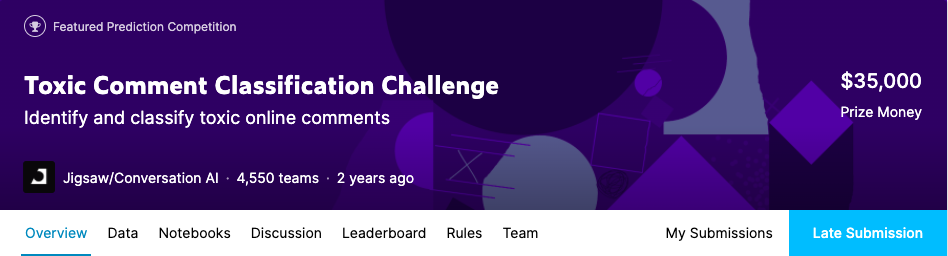

<div align='center'><h2>Toxic Comment Classification Challenge</h2></div>

<div align='center'><h3>Identify and classify toxic online comments</h2></div>
<div align='center'>June 25, 2020</div>

<br>
<p align="center">
  
</p>

## Context
During our year of Post Master's Degree in Big Data at Télécom Paris, we carried out a three-month project on the identification and classification of online toxic comments. <br>
More details about Télécom Paris <a href="https://www.telecom-paris.fr/en/post-masters-degree/all-post-masters-degree/post-masters-degree-in-big-data">here</a>.
<br>
<br>
This project stems from the <a href="https://www.kaggle.com/c/jigsaw-toxic-comment-classification-challenge/overview">Kaggle challenge</a> of the same name, organized by <a href="https://jigsaw.google.com/">Jigsaw</a> and <a href="https://conversationai.github.io/">Conversation AI</a>. 
<br>
The objective of this challenge was to build a multi-headed model that’s capable of detecting different types of of toxicity like threats, obscenity, insults, and identity-based hate better than Perspective’s current models.
<br>
More details about Perspective <a href="https://www.perspectiveapi.com/#/home">here</a>.
<br>
<br>
In our study, several deep learning approaches are used and compared. Logistic regression (LR), Long Short-Term Memory Networks (LSTM), Convolutional Networks (CNN) combined with language processing techniques (NLP) and word representation methods (Word Embedding) are studied. These different approaches are evaluated using training and test sets provided by the actors of the Kaggle competition. These datasets are composed of approx 160k human labelled comments from Wikipedia Talk pages including 6 types of label : toxic, severe toxic, insult, threat, obscene and identity hate. Finally, a web application is developed and deployed to allow anyone to check the toxicity of a comment.
<br>


## Key figures
<ul>
  <li><b>Duration</b> : 3 months from 24 March to 25 June.</li>
  <li><b>Participants</b> : 4 students.</li>
  <li><b>Data</b> : a train and a test set from the Kaggle competition.</li>
  <li><b>Environment</b> : Python, Colab Pro, Keras, Dash, Heroku. 
</ul>

## Results

<div align='justify'>
The final selected model is based on a bi-directional LSTM neural network architecture. <br>
The results of this model are excellent: the AUC score obtained is 98% :trophy:. This model is therefore able to predict with great accuracy whether a comment is toxic or not, and to determine the type of toxicity. <br>
As we participated in this competition as a "late submission", we cannot obtain a ranking. 
</div>


## Our app

The application is contained in the ```app``` folder. The model is not include in the folder because it was too heavy (~250 Mo). <br>
To launch the application, simply move to the folder by typing in the Terminal :<br>

```python 
cd path_to_folder
``` 
<br>

Then type: <br>

```python 
python app.py
``` 
<br>

It will then be possible to open the application with the local server address ```http://127.0.0.1:8050/```. <br>

<p align="center">
  
</p>

## Presentation of our team

<br>
All the members are students of the Post-Master's Degree in Big Data (Promotion 2019-2020) at Telecom Paris (an IP Paris school). 
<br>
<br>
Full curriculum and details of our degree <a href="https://www.telecom-paris.fr/en/post-masters-degree/all-post-masters-degree/post-masters-degree-in-big-data">here</a>.
<br>
<br>
Team members :
<br>
<br>

<table class="tg">
  <tr>
    <th class="tg-amwm">Name</th>
    <th class="tg-amwm">Github</th>
  </tr>
  <tr>
    <td class="tg-baqh">Hamza AMRI</td>
    <td class="tg-baqh"><a href="https://github.com/hamza-04">hamza-04</a></td>
  </tr>
  <tr>
    <td class="tg-baqh">Camille COCHENER</td>
    <td class="tg-baqh"><a href="http://github.com/camillecochener">camillecochener</a></td>
  </tr>
  <tr>
    <td class="tg-baqh">Sophie LEVEUGLE</td>
    <td class="tg-baqh"><a href="https://github.com/sophieleveugle">sophieleveugle</a></td>
  </tr>
  <tr>
    <td class="tg-baqh">Rodolphe SIMONEAU</td>
    <td class="tg-baqh"><a href="https://github.com/rodolphesimoneau">rodolphesimoneau</a></td>
  </tr>
</table>


